# Example Walkthrough

Open up the cosmos db model file you are going to work on found in the /infrastructure/data-sources/cosmos-db/models/ directory.  In this example, we are working with physician.ts model

<figure>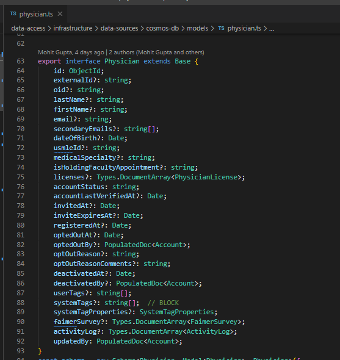<figcaption>
Cosmos DB Model (/infrastructure/data-sources/cosmos-db/models/physician.ts)
</figcaption></figure>

In /domain/contexts/ directory, you will find various directories named with different contexts

Find the folder for domain object you are working on and create a file named after the interface which extends Base in the cosmos db schema

An interface that extends Base means the domain object is an [Aggregate Root](initial-setup/aggregate-root.md)

In this example, we look under /domain/contexts/ for the physician folder

We create the stub domain context file physician.ts in /domain/contexts/physician/

<figure>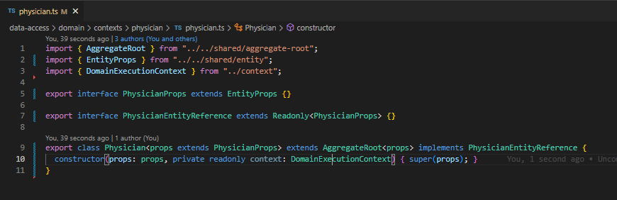<figcaption>
Physician Domain Context file (/domain/contexts/physician/physician.ts)
</figcaption></figure>

Copy the fields from cosmos db model for Physician into PhysicianProps on domain side&#x20;

Refer to the [Field Types](field-types/) documentation about what to do for primitive and non-primitive type fields

<figure>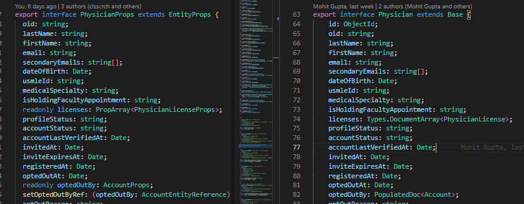<figcaption>
Domain Props on left, Cosmos DB Model on right
</figcaption></figure>

The first non-primitive type in this example is the licenses field on line 74 in the Cosmos DB model On domain props side, the licenses field should be a readonly PropArray of PhysicianLicenseProps

Now we have to make the domain context file for PhysicianLicense. Look for the interface in the cosmos db model for physician

<figure>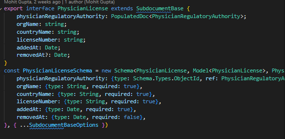<figcaption>
PhysicianLicense Cosmos Model (/infrastructure/data-sources/cosmos-db/models/physician.ts)
</figcaption></figure>

In this example, PhysicianLicense interface extends SubdocumentBase&#x20;

so PhysicianLicenseProps extend EntityProps and the PhysicianLicense class extends [Entity ](initial-setup/entity.md)

Created this physician-license.ts domain context file in /domain/contexts/physician/&#x20;

<figure>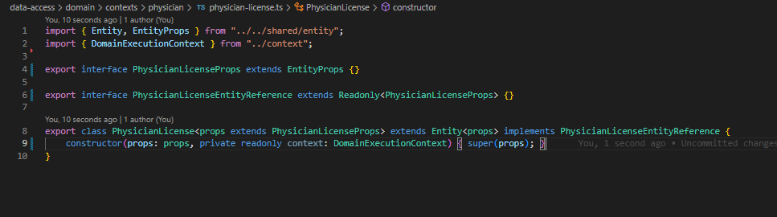<figcaption>
Physician License Domain Context file (/domain/contexts/physician/physician-license.ts)
</figcaption></figure>

Now you fill out the props for the PhysicianLicense using the interface on the cosmos db side

The first field in our case is type [PopulatedDoc ](field-types/non-primitive-types/populateddoc.md)reference to another aggregate root so we have to treat it differently than a primitive field.

The type of the field is PhysicianRegulatoryAuthorityProps and it's readonly

Also need a setPhysicianRegulatoryAuthorityRef field below it, which is a method that takes a PhysicianRegulatoryAuthorityEntityReference as an argument &#x20;

Note: You only need this setRef field if in the cosmos db schema you see type: ObjectId and ref, otherwise the field is local to the aggregate root&#x20;

<figure>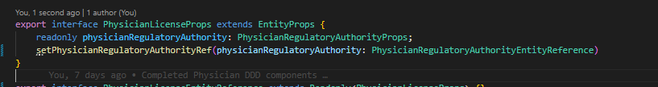<figcaption>
Physician License Domain Props (/domain/contexts/physician/physician-license.ts)
</figcaption></figure>

Now fill out the rest of the fields from the PhysicianLicense interface in the cosmos db model

<figure>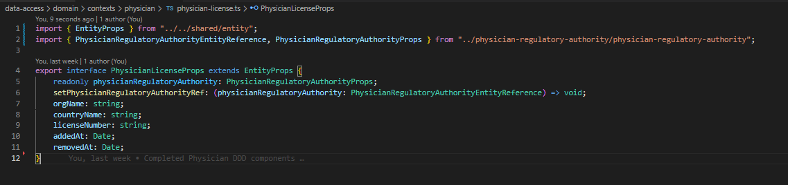<figcaption>
Physician License Domain Props (/domain/contexts/physician/physician-license.ts)
</figcaption></figure>

Next step is the entity reference interface.

Every field that refers to another props or if the field is a setRef method needs to be omitted&#x20;

The names of the field are passed as a union of strings. Refer to the image below. If the props only contains primitive fields, then you can leave the entity reference as it is. &#x20;

<figure>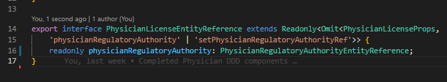<figcaption>
Physician License Entity Reference (/domain/contexts/physician/physician-license.ts)
</figcaption></figure>

The last step is the class for the domain object

Since the cosmos db model is a SubdocumentBase, this class should extend Entity

Need to create getters for every field and requestSet methods for all the primitive and PopulatedDoc type fields

<figure>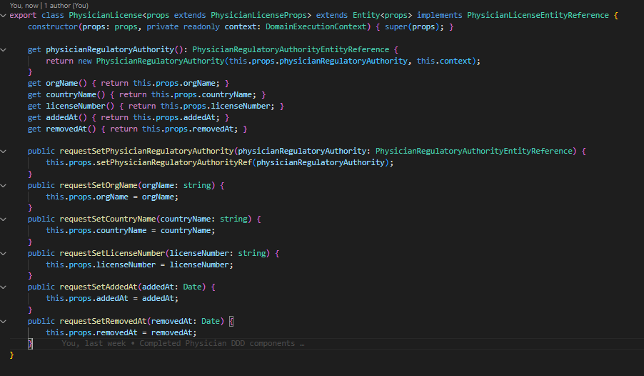<figcaption>
Physician License Domain Class (/domain/contexts/physician/physician-license.ts)
</figcaption></figure>

For fields that are props of another domain context, we pass the props field into that domain context's constructor along with the context. &#x20;

For the requestSet of those fields, we use the setRef field we created in the props and pass in that domain context's entity reference.&#x20;

This domain context file for PhysicianLicense is now complete. We can go back to physician.ts and import it.&#x20;

In the cosmos db physician interface, it says licenses is a [Types.DocumentArray](field-types/non-primitive-types/types.documentarray.md) so we need to wrap PhysicianLicenseProps in a PropsArray for the domain props field type.

Also make sure the field is readonly, just like we do for any props type field.&#x20;

Since this is a PropsArray, we don’t need a setRef field for licenses.&#x20;

&#x20;Don't forget to omit licenses from the entity reference interface.&#x20;

For PropsArray fields, we use a ReadonlyArray for the entity reference.&#x20;

<figure>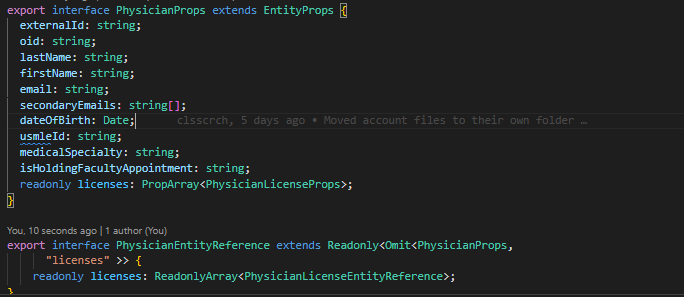<figcaption>
Physician Domain Context File (/domain/contexts/physician/physician.ts)
</figcaption></figure>

Continue going through the rest of the Physician interface fields in cosmos db model

You may reach a field which refers to a [Custom Type](field-types/non-primitive-types/custom-types.md) defined locally in the cosmos db model

In this example, PhysicianSystemTagProperties is a NestedPath. Therefore, we have to create a physician-system-tag-properties.ts domain context file

Since PhysicianSystemTagProperties is a NestedPath, the props interface should extend ValueObjectProps and the class should extend [Value Object](initial-setup/value-object.md).&#x20;

Also, Value Objects don’t use the props extends generic structure that you see for Aggregate Root or Entity extended-classes.&#x20;

<figure>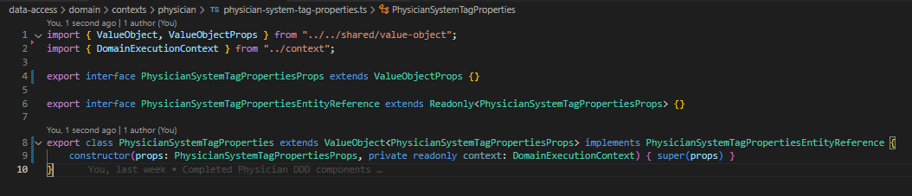<figcaption>
Physician System Tag Properties Domain Context file (/domain/contexts/physician/physician-system-tag-properties.ts)
</figcaption></figure>

Now you just have to fill out the props just as you did for the other domain context files

For this example, there is only one primitive field so it's a relatively simple domain object

<figure>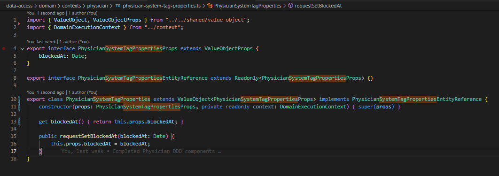<figcaption>
Physician System Tag Properties Domain Context file (/domain/contexts/physician/physician-system-tag-properties.ts)
</figcaption></figure>

Now you should have seen every scenario you might encounter when building up the domain context files.&#x20;

You should be able to translate any cosmos db model into the domain layer.&#x20;

&#x20;
