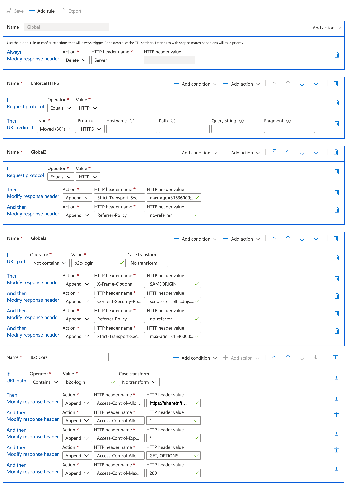

# CDN Rules

Securing your static website:

Without configuring rules in your CDN the azure static website will get a grade of F from a security header perspective.



The basic (most affordable) Azure CDN Has a limit on the number of global rules (as of this time it is 3), the approach outlined below attempts to address the most urgent security concerns and work within these constraints.

CDN headers that will be configured:

* Add
  * X Frame Options
    * [Mozilla Documentation](https://developer.mozilla.org/en-US/docs/Web/HTTP/Headers/X-Frame-Options)
  * Content Security Policy
    * [Mozilla Documentation](https://developer.mozilla.org/en-US/docs/Web/HTTP/Headers/Content-Security-Policy)
  * Strict Transport Security
    * [Mozilla Documentation](https://developer.mozilla.org/en-US/docs/Web/HTTP/Headers/Strict-Transport-Security)
  * Referrer Policy
    * [Mozilla Documentation](https://developer.mozilla.org/en-US/docs/Web/HTTP/Headers/Referrer-Policy)
  * HTTPS Redirect (301)
    * [Google Documentation](https://support.google.com/webmasters/answer/6073543?hl=en)
* Remove
  * Server
    * [Mozilla Documentation](https://developer.mozilla.org/en-US/docs/Web/HTTP/Headers/Server)


Important regarding the  /b2c-login path\
\
The path "b2c-login" has different rules as we will serve our custom login assets from that path and because they are loaded by B2C they need different security headers. ([Read More](https://docs.microsoft.com/en-us/azure/active-directory-b2c/customize-ui-with-html?pivots=b2c-custom-policy#3-configure-cors) on this)


###

### Configure Rules Engine&#x20;

Navigate to the CDN you've created

Select **Rules Engine** under Settings in the left pane. Add the following rules:

#### Global

* Choose "Add action" , choose "Modify Response Header" for adding each of the following
*

    * Add _Action_ "Delete"
      * Choose:
        * HTTP header name: **Server**
    * Add Action "Append"
      * Choose
        * HTTP header name: **X-Content-Type-Options **
        * HTTP header value**: nosniff**

\*\* Make sure copy and paste gets correct value (Leading/Trailing spaces, special characters)

#### New Rule: \[Name:EnforceHTTPS]

* Choose "Add Rule", name **EnforceHTTPS**
* Add Condition "Request Protocol"
  * Choose:
    * If : Request protocol \[Operator : **Equals**] \[Value : **HTTP**]
* Add Action "URL Redirect"
  * Choose:
    * Then URL Redirect \[Type: **Moved (301)**] \[Protocol: **HTTPS**]&#x20;
    * (leave all other fields empty)

#### New Rule: \[Name:Global2]

* Choose "Add Rule", name **Global2**
* Add _Condition_ "Request Protocol"
  * Choose:
    * If : Request protocol \[Operator : **Equals**] \[Value : **HTTP**]
* Add _Action_ "Modify Response Header"
  * Choose:
    * Then Modify response header \[Action: **Append**]&#x20;
    * HTTP header name: **Strict-Transport-Security**
    * HTTP header value: **max-age=31536000; includeSubDomains; preload**
* Add _Action_ "Modify Response Header"
  * Choose:
    * Then Modify response header \[Action: **Append**]&#x20;
    * HTTP header name: **Referrer-Policy**
    * HTTP header value:**no-referrer**

#### New Rule: \[Name:Global3]

* Choose "Add Rule", name **Global3**
* Add _Condition_ "if URL path"
  * Choose:
    * If : Request protocol \[Operator : **Not contains**] \[Value : **b2c-login**]
    * Case Transform: No transform
* Add _Action_ "Modify Response Header"
  * Choose:
    * Then Modify response header \[Action: **Append**]&#x20;
    * HTTP header name: **X-Frame-Options**
    * HTTP header value: **SAMEORIGIN**
* Add _Action_ "Modify Response Header"
  * Choose:
    * Then Modify response header \[Action: **Append**]&#x20;
    * HTTP header name: **Content-Security-Policy**
    * HTTP header value: **script-src 'self' cdnjs.cloudflare.com**
* Add _Action_ "Modify Response Header"
  * Choose:
    * Then Modify response header \[Action: **Append**]&#x20;
    * HTTP header name: **Referrer-Policy**
    * HTTP header value: **no-referrer**
* Add _Action_ "Modify Response Header"
  * Choose:
    * Then Modify response header \[Action: **Append**]&#x20;
    * HTTP header name: **Strict-Transport-Security**
    * HTTP header value: **max-age=31536000; includeSubDomains; preload**

**Important**: Be sure to configure your **Content-Security-Policy** for every external source you will load javascript from.

#### New Rule: \[Name:B2CCors]

* Choose "Add Rule", name **B2CCors**
* Add _Condition_ "if URL path"
  * Choose:
    * If : Request protocol \[Operator : **Contains**] \[Value : **b2c-login**]
    * Case Transform: No transform
* Add _Action_ "Modify Response Header"
  * Choose:
    * Then Modify response header \[Action: **Append**]&#x20;
    * HTTP header name: **Access-Control-Allow-Origin**
    * HTTP header value: **<\<your b2c endpoint, e.g. https://sharethriftexternal.b2clogin.com>>**
* Add _Action_ "Modify Response Header"
  * Choose:
    * Then Modify response header \[Action: **Append**]&#x20;
    * HTTP header name: **Access-Control-Allow-Headers**
    * HTTP header value: **\***
* Add _Action_ "Modify Response Header"
  * Choose:
    * Then Modify response header \[Action: **Append**]&#x20;
    * HTTP header name: **Access-Control-Expose-Headers**
    * HTTP header value: **\***
* Add _Action_ "Modify Response Header"
  * Choose:
    * Then Modify response header \[Action: **Append**]&#x20;
    * HTTP header name: **Access-Control-Allow-Methods**
    * HTTP header value: **GET, OPTIONS**
* Add _Action_ "Modify Response Header"
  * Choose:
    * Then Modify response header \[Action: **Append**]&#x20;
    * HTTP header name: **Access-Control-Max-Age**
    * HTTP header value: **200**

Choose Save:

When completed the settings should look like the following:

Additional Resources:

* [Hardening your HTTP Response Headers](https://scotthelme.co.uk/hardening-your-http-response-headers/)
