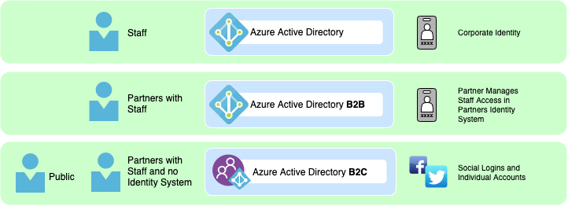

# Identity and Access Control

Partners with Staff - With Existing Identity Provider

&#x20;Leveraging Azure Active Directory B2B Direct Federation allowing the partner to leverage their existing IDP to manage employee's access to and roles granted within the application.

Administrators of Partners will log in using the MSAL configuration "admin consent" - Direct Administrators to this document to understand how to configure an application to [require user assignment ](https://docs.microsoft.com/en-us/azure/active-directory/manage-apps/assign-user-or-group-access-portal)otherwise the app will be available to all staff in the organization.

SCIM

* &#x20;[SCIM Decision Tree](https://docs.microsoft.com/en-us/azure/active-directory/app-provisioning/scim-graph-scenarios)

Resources:

* [Microsoft's Multi-tenant SAAS Sample](https://github.com/mspnp/multitenant-saas-guidance)
* [Handling multiple issuers](https://docs.microsoft.com/en-us/azure/active-directory/develop/howto-convert-app-to-be-multi-tenant#update-your-code-to-handle-multiple-issuer-values)
* [Tenant Signup Documentation](https://docs.microsoft.com/en-us/azure/architecture/multitenant-identity/signup) - Admin Consent
* [MultiTentant Highlevel docs ](https://docs.microsoft.com/en-us/azure/architecture/multitenant-identity/)
* [Requesting Admin Consent with React](https://docs.microsoft.com/en-us/azure/active-directory/develop/howto-convert-app-to-be-multi-tenant)
* OIDC / SCIM projects&#x20;
  * [Janssen](https://github.com/JanssenProject) Project (by Glluu) &#x20;

[https://docs.microsoft.com/en-us/azure/active-directory/develop/howto-convert-app-to-be-multi-tenant](https://docs.microsoft.com/en-us/azure/active-directory/develop/howto-convert-app-to-be-multi-tenant)
